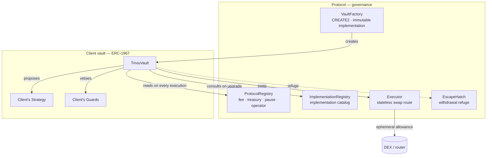
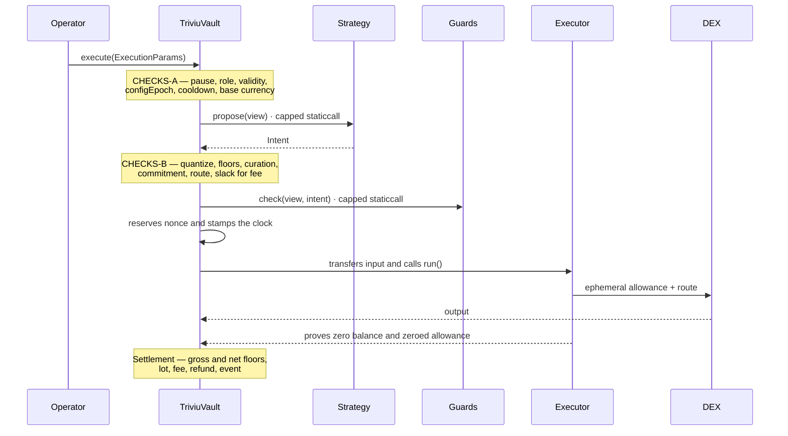

# Triviu Protocol

Non-custodial trading vaults on Polygon. Each client has a contract of their own that holds their
funds, runs a strategy they declared, and from which they can withdraw at any time — without depending
on whoever operates the service.

The off-chain service (`Operator`) proposes executions and pays their gas. It has **no** custody, does
**not** choose what is traded and **cannot** move funds out of the vault. What it can do is trigger an
execution the vault has already authorized by construction, and be refunded for gas within a ceiling
the vault itself imposes.

| | |
|---|---|
| Solidity | `0.8.28`, EVM `cancun`, optimizer `1_000_000` runs |
| Toolchain | [Foundry](https://book.getfoundry.sh/) |
| Standards | ERC-1967 (proxy), ERC-7201 (namespaced storage), CREATE2 |

## Deployment status — read this before matching code to a chain

**Nothing in this directory is deployed.** `deployments/` holds only `999999.json`, the local chain.
The runbook for the first genesis is [`DEPLOY.md`](DEPLOY.md).

What **is** live on Polygon PoS is the previous line, whose source is no longer at `HEAD` — it is one
commit back, at `11d2c5f`. The console under `site/` operates those, and that is why it references
contracts you will not find here:

```
parameterRegistry  0x1Adab61ef019d853BBcFaf65E929961b11897856
triviuExecutor     0xEdB5Aa01fd055B3755439cE41B92b575eea1d273
gasTank            0xFF0Dc2fC461E28bbAC7964496535989311e93f56
triviuLPVault      0xC52BaD280809672D8EC5D1fcF2d7eCa45a2a423E
triviuRegistry     0xac89E63F4F7d26A5CefDc6bA5a13d8F507A7EF1D
triviuFactory      0x862fD93E6106F07D9395FF14fFE6d828994e8Ee8
```

Measured against the chain at block 91859211, not read from a deploy log. To read the code behind
any of them: `git show 11d2c5f:contracts/src`.

So: the code here is the next line and it has never held money; the addresses above hold money and
their code is one commit back. Anyone reviewing a live contract should be reading the chain and the
history, not this directory.

---

## Contents

- [Architecture](#architecture)
- [Trust model](#trust-model)
- [Execution cycle](#execution-cycle)
- [Security guarantees](#security-guarantees)
- [Getting started](#getting-started)
- [Tests](#tests)
- [Protocol deployment](#protocol-deployment) · runbook in [`DEPLOY.md`](DEPLOY.md)
- [Client onboarding](#client-onboarding)
- [Repository layout](#repository-layout)
- [Known limits](#known-limits)

---

## Architecture



| Contract | Responsibility | Runtime |
|---|---|---|
| `TriviuVault` | Custody, mandate, execution, positions and upgrade of the vault | 22.250 B |
| `VaultFactory` | Creates vaults at a predictable address; `IMPLEMENTATION` is `immutable` | 2.416 B |
| `ProtocolRegistry` | Fee, treasury, global pause, operator role, base-currency and executor curation | 3.992 B |
| `ImplementationRegistry` | Catalog of what may be adopted in an upgrade | 3.152 B |
| `Executor` | Runs the route and proves it kept nothing | 2.248 B |
| `EscapeHatch` | Refuge implementation: only reads the owner and withdraws | 915 B |

`TriviuVault` is composed of five mixins with storage in separate ERC-7201 namespaces:
`VaultConfig` (mandate), `VaultCustody` (in and out), `VaultExecution` (the execution path),
`VaultPositions` (lots) and `VaultUpgrade` (timelock and refuge).

---

## Trust model

| Role | Key | Can | Cannot |
|---|---|---|---|
| **Owner** | the client's | Configure the mandate, deposit, withdraw, change implementation, trigger the refuge | Escape the protocol pause, the fee, or the upgrade timelock |
| **Operator** | hot, the service's | Trigger executions that pass every check; be refunded for gas within the ceiling | Withdraw, choose assets, change configuration, or hand the input to an uncurated executor |
| **Governance** | cold, multisig | Fee (1% ceiling), treasury, pause, base-currency and executor curation, publish implementations | Touch a client's vault or funds |
| **Treasury** | any | Receive the fee | Anything else |

The client's mandate is what limits the operator: allowed assets, base currency, `Strategy`, `Guards`,
cooldown, maximum validity, minimum ratio and quantum. Any change increments the `configEpoch`, and
every in-flight proposal that read the previous epoch is refused with `ConfigEpochStale`.

What the mandate does **not** limit, and you should read before trusting an operator with a vault:
the operator authors the route — `target`, `spender` and `calldata` — and nothing on-chain prices
it. Three floors can reject a bad fill, and only one of them is yours. `Limits.minRatioBps` never
sees the realised amount (`Floors.meetsMinRatio` compares the *declared* `minOut`), and
`operatorMinOut` is declared by the operator themselves — neither constrains an operator. What
constrains one is `Intent.minOut`, which comes from your `Strategy`.

So a `Strategy` that declares no floor on its buy leg leaves all three at zero, and the vault
accepts a buy that returns nothing. `ExampleStrategy` therefore takes `MIN_OUT_PER_TICKET` by
constructor and **refuses zero** rather than treating it as a default; a partial ticket demands a
proportional share of it, **rounded up**.

The rounding direction is not a detail. Rounded down, the share reaches exactly zero whenever
`MIN_OUT_PER_TICKET × amountIn < TICKET` — and with a floor of `1`, on every partial buy up to a
whole ticket minus one unit. The constructor's refusal of zero would then be a check satisfiable
without protecting, which is worse than no check, because it teaches the workaround to whoever
misread the asset's unit. Pinned in `test_theBuyFloorNeverRoundsAwayToZero`, alongside
`test_theExampleStrategyRefusesToShipWithoutABuyFloor` for the constructor and
`test_aBuyWithEveryFloorAtZeroAcceptsAZeroFill` for the vault-level behaviour.

The floor is a number you choose, not a price the protocol discovers — there is no oracle here.
Set it from what you consider an acceptable price for a ticket, and plug a `Guard` if you need the
intent judged against something richer.

---

## Execution cycle



**CHECKS-A** runs before any expensive read: protocol paused, caller is operator, proposal not
expired, validity within the owner's ceiling, configuration epoch, cooldown and base currency enabled.

**CHECKS-B** runs on the intent: quantization, minimum ticket, minimum ratio, base-currency curation
on a buy, sellable lot on a sell, cryptographic commitment, executor curation, allowed route and
balance slack for fee and refund.

The **executor curation** is the one check standing between the submitter and the funds: the vault
transfers `amountIn` to `p.executor` before the route runs, and `p.executor` is a field the submitter
fills in. `ProtocolRegistry.isExecutor` is read on every call rather than at configuration time, so
an executor withdrawn by governance stops being accepted on the next execution, with no migration
and no epoch bump.

The **commitment** binds the proposal to what is submitted. `proposalHash` covers `chainid`, vault,
nonce, epoch, `Strategy`, legs, amount and lot; `executionHash` adds executor, target, spender, floors,
validity, refund and the hash of the route calldata. A single altered field reverts with
`CommitmentMismatch`, and the nonce prevents replay.

---

## Security guarantees

- **Inalienable custody.** Only the owner deposits and withdraws. No protocol role has a path to a
  vault's funds.
- **Refuge without timelock.** `adoptEscapeHatch()` swaps the vault's implementation for the
  `EscapeHatch`, whose address is `immutable` since the constructor. From then on the vault only knows
  how to withdraw. It goes through neither the catalog nor the wait.
- **Upgrade with a window.** Propose → 2-day timelock → 7-day window. The catalog is consulted when
  proposing **and** when executing: an implementation deprecated midway is not adopted.
- **Sandboxed plugins.** `Strategy` and `Guards` are called via `staticcall` with a 300,000 gas cap
  and return truncated at 512 bytes. A plugin that reverts, lies in its return or burns gas brings
  down the execution — never the vault.
- **Executor without residue.** Every call ends by proving the allowance was zeroed and that the
  input and output balances returned to their prior values. A router that leaves leftovers reverts.
- **Restricted route.** Target and spender may not be the vault, the executor, nor any listed token —
  this closes the path of making the vault sign a `transferFrom` disguised as a swap.
- **Protected last admin.** `Governed` refuses the renouncement of a registry's last admin, which
  makes a live yet ungovernable registry unreachable.
- **Refund with three ceilings.** `min(declared, one whole unit of the base, 1% of the traded amount)`.

---

## Getting started

Prerequisites: [Foundry](https://getfoundry.sh/) and `git`.

```bash
git clone --recurse-submodules <repo-url> triviu-protocol
cd triviu-protocol

cp .env.example .env     # fill it in before any deploy

forge build
forge test
```

The destination directory is your choice — the name above only exists so the `cd` on the next line
works. If you already cloned without `--recurse-submodules`, run
`git submodule update --init --recursive` before `forge build`: `forge-std` and
`openzeppelin-contracts` are submodules.

`forge` loads the `.env` from the root on its own. No private key goes into it: whoever signs is
always a keystore account.

```bash
cast wallet import <alias> --interactive   # creates the alias and prompts for the key and a password
cast wallet list                           # shows the aliases already present on this machine
```

`<alias>` is the name **you** gave the key on this machine — the keystore is local, so an alias from
one computer does not exist on another. Every command in this README uses `<alias>` as a placeholder:
replace it with yours, or export `ACCOUNT_ALIAS=...` and use `--account "$ACCOUNT_ALIAS"`.

---

## Tests

```bash
forge test                                     # the whole suite
forge test --match-path "test/unit/*"          # units
forge test --match-path "test/integration/*"   # end-to-end execution path
forge test --match-path "test/invariant/*"     # invariants
forge coverage
```

| Layer | Covers |
|---|---|
| `test/unit/lib` | `Limits`/`ExecConfig` packing, fees, floors, quantization, lots, commitment, plugin sandbox |
| `test/unit/protocol` | Last-admin guard, registries, factory, refuge, executor |
| `test/unit/vault` | Mandate and epoch, custody, positions, upgrade timelock |
| `test/integration` | Every CHECKS-A and CHECKS-B revert, settlement, fee, refund, lot cycle |
| `test/invariant` | Executor always empty, backed lots, nonce = executions, no residual allowance |
| `test/script` | `01_Deploy` (validation and admin handover) and offline `UserFlow` |

CI (`.github/workflows/test.yml`) runs `forge fmt --check`, `forge build --sizes --skip 'test/**'`
and `forge test`. The size gate skips the harness because the limits apply to what reaches a chain:
`--sizes` already drops contracts inheriting `Test`/`Script`, and the invariant `Handler` inherits
neither by design, which put its 52,502 B of initcode into the report.

---

## Protocol deployment

The genesis is one run: six contracts, four acts of curation and the handover of `DEFAULT_ADMIN_ROLE`.

```bash
forge script script/01_Deploy.s.sol --tc Deploy \
  --rpc-url polygon --account <alias> --broadcast --slow
```

Here `<alias>` is the **deployer's** key: hot, ephemeral, and different from `GOVERNANCE` and
`OPERATOR` — the script refuses if it matches either of the two. It is born admin of both registries
and renounces in the same run.

Internal order, which is not a preference:

1. `EscapeHatch` and `Executor`.
2. `ProtocolRegistry` and `ImplementationRegistry`, both with the deployer as admin.
3. `TriviuVault` (the implementation), which receives the hatch via constructor.
4. `VaultFactory`, which requires the implementation to be already deployed and pins it as `immutable`.
5. Curation: publishes v1, curates the base currency, curates the `Executor` deployed in step 1,
   grants the operator role. Before the handover, so the genesis leaves a vault that can trade —
   an uncurated executor would make every execution revert with `ExecutorNotCurated` until
   governance intervened.
6. Handover: grants admin to governance and renounces — in this order, otherwise the last-admin guard
   reverts.

The configuration is validated **before** the first broadcast, the handover is asserted after it, and
the record is written to `deployments/<chainId>.json` only when there was a real broadcast.

| Variable | Requirement |
|---|---|
| `GOVERNANCE` | Non-zero and different from the deployer |
| `TREASURY` | Non-zero |
| `OPERATOR` | Non-zero, different from the deployer and from governance |
| `BASE_TOKEN` | Contract with exactly 6 decimals |
| `FEE_BPS` | At most 100 (1%) |

---

## Client onboarding

```bash
forge script script/user/UserFlow.s.sol --tc UserFlow \
  --rpc-url polygon --account <alias> --broadcast --slow
```

Here `<alias>` is the **client's** key, not the deploy one: the vault's owner is the signing address,
and the deposit comes out of it.

Creates the vault, writes the mandate and funds it — all in one transaction per step, with the client
signing. The nine actions also run standalone. The `--tc` is the contract, which is the file name
without its number — the number orders the steps and is not part of the name:

```bash
forge script script/user/actions/09_Withdraw.s.sol --tc Withdraw \
  --rpc-url polygon --account <alias> --broadcast --slow
```

| Step | File | `--tc` | What it does |
|---|---|---|---|
| 1 | `01_CreateVault.s.sol` | `CreateVault` | Creates through the factory, or recognizes the vault already at the predicted address |
| 2 | `02_SetAllowedAsset.s.sol` | `SetAllowedAsset` | Allows a tradable asset |
| 3 | `03_SetBaseCurrency.s.sol` | `SetBaseCurrency` | Enables the base currency on the vault |
| 4 | `04_SetStrategy.s.sol` | `SetStrategy` | Plugs in the declared `Strategy`, or deploys the example one |
| 5 | `05_SetLimits.s.sol` | `SetLimits` | Cooldown, maximum validity, minimum ratio, quantum |
| 6 | `06_AddGuard.s.sol` | `AddGuard` | Plugs in the declared `Guard`, or deploys the example one |
| 7 | `07_ApproveBaseCurrency.s.sol` | `ApproveBaseCurrency` | Allowance for the deposit |
| 8 | `08_Deposit.s.sol` | `Deposit` | Ensures the allowance and deposits |
| 9 | `09_Withdraw.s.sol` | `Withdraw` | Withdrawal of the base currency, at any time |

Every standalone action reads `VAULT` from the `.env`, and `05_SetLimits` also reads `MIN_RATIO_BPS`,
which has no default — see `.env.example`.

The protocol addresses come from `deployments/<chainId>.json`; the actions revert naming the missing
key if the file does not exist. The order of steps 2 to 6 is free — what is not free is the boundary:
all configuration comes before handing the vault to the service, because every setter increments the
`configEpoch`.

The plugins in `script/user/ExamplePlugins.sol` are runnable examples, not product: the
`ExampleStrategy` round-trips with `minOut` equal to the allocated capital, and the
`ExampleFullBackingGuard` refuses an unbacked sell. Anyone serious writes their own.

---

## Repository layout

```
src/
  vault/           TriviuVault and its five mixins, libraries and types
  api/             The surface that Strategy and Guard see
  protocol/        Registries, factory, executor, refuge, access control
script/
  01_Deploy.s.sol  The genesis, in two levels: .env adapter and logic
  user/            Onboarding and the nine actions, each a library + contract
  util/            Reading and writing of deployments/
test/
  unit/            Per library and per contract
  integration/     End-to-end execution path
  invariant/       Handler and invariants
  script/          Deploy and UserFlow
  util/            Fixture and mocks
deployments/       Record of what was deployed, per chain and per user
```

---

## Known limits

- **Fee-on-transfer tokens** are out of scope: the vault credits whatever `balanceOf` reports,
  without trying to correct the difference.
- **Permit2 and `UniversalRouter`** do not work as a route: the `Executor` approves via plain
  allowance and has no key to sign with.
- **The fork suite** against Polygon does not exist yet; current coverage is entirely in memory.
- **The genesis base currency** is pinned to 6 decimals by the deploy validation, because the absolute
  refund ceiling is one whole unit of it.

---

## Reporting a vulnerability

Privately, never in a public issue or pull request. Scope, safe harbour and the channel are in
[`SECURITY.md`](SECURITY.md). Nothing here has been deployed to a public network, so there are no
funds at risk and no bug bounty.

## Contributing

Four CI steps, LF line endings that are not a style preference, and two rules about tests that this
repository learned the hard way. [`CONTRIBUTING.md`](CONTRIBUTING.md).

## License

AGPL-3.0-only, the licence of the repository — see [`LICENSE`](../LICENSE) at the root. Every
source file here carries the matching `SPDX-License-Identifier`.

One protocol, one licence. There is no separate licence for this directory.
